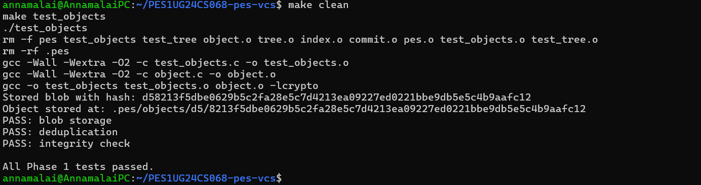
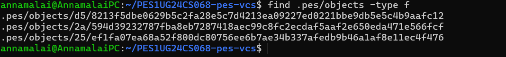
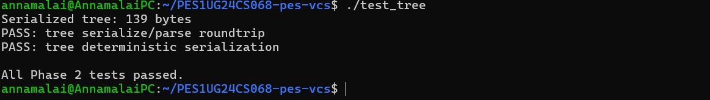
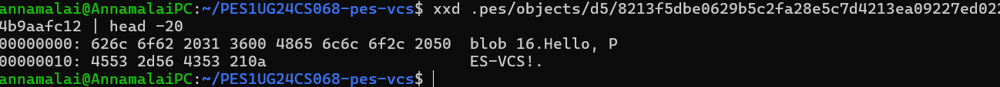
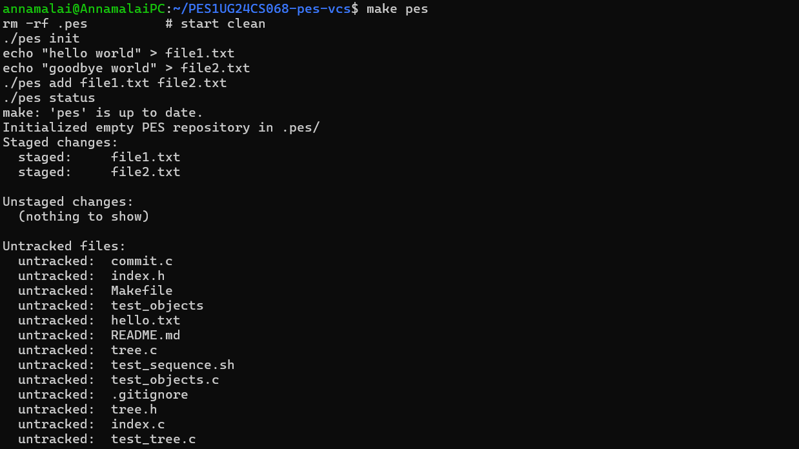
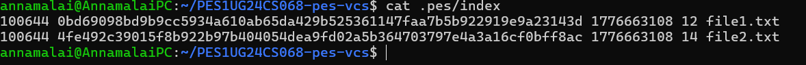
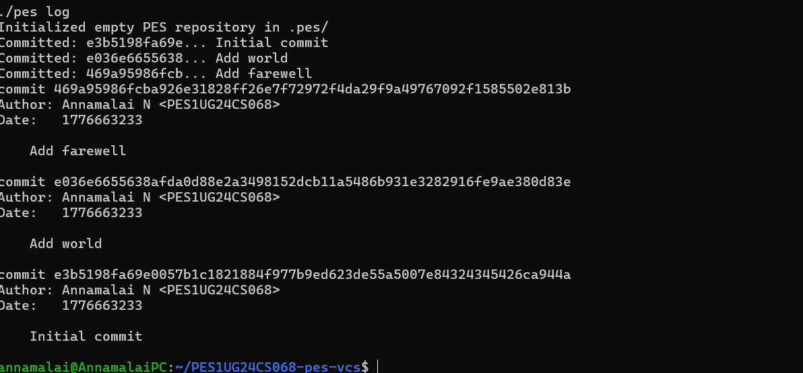
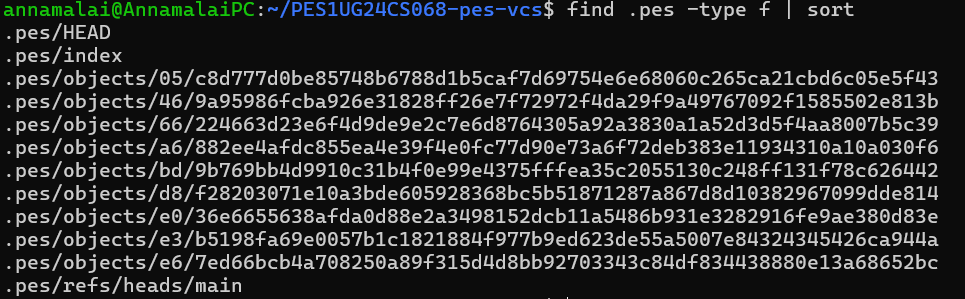
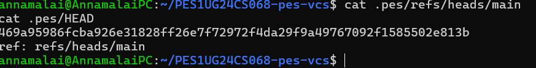
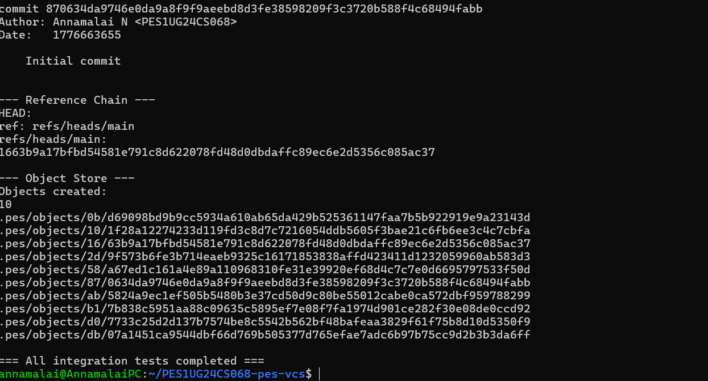

# PES-VCS Lab Report

**Name:** Annamalai N  
**SRN:** PES1UG24CS068  
**Section:** 4B  
**Date:** 20-04-2026

---

## Table of Contents

1. [Phase 1 — Object Storage](#phase-1--object-storage)
2. [Phase 2 — Tree Objects](#phase-2--tree-objects)
3. [Phase 3 — Index / Staging Area](#phase-3--index--staging-area)
4. [Phase 4 — Commits and History](#phase-4--commits-and-history)
5. [Integration Test](#integration-test)
6. [Phase 5 — Branching and Checkout (Analysis)](#phase-5--branching-and-checkout-analysis)
7. [Phase 6 — Garbage Collection (Analysis)](#phase-6--garbage-collection-analysis)

---

## Phase 1 — Object Storage

### What was implemented

`object_write` and `object_read` in `object.c`.

`object_write` prepends a type header of the form `"blob 16\0"` to the raw data, computes the SHA-256 of the combined header and data, checks for deduplication (if the hash already exists on disk, it returns early), creates the shard directory using the first two hex characters of the hash, writes the full object to a temporary file in that directory, calls `fsync()` on the file descriptor, atomically renames it to the final path, and then `fsync()`s the shard directory to persist the rename. Finally it writes the computed hash into `*id_out`.

`object_read` reconstructs the object's file path from the hash using `object_path()`, reads the entire file into memory, recomputes the SHA-256 of what was read and compares it byte-for-byte against the hash in the filename — if they differ, it returns `-1` immediately (corruption detected). Otherwise it finds the null byte separating the header from the data, parses the type string (`"blob"`, `"tree"`, `"commit"`), allocates a buffer, copies the data portion into it, and returns the type, pointer, and length to the caller.

### Screenshot 1A — `./test_objects` output



### Screenshot 1B — Sharded directory structure



## Phase 2 — Tree Objects

### What was implemented

`tree_from_index` in `tree.c`.

The function loads the current index, sorts all entries by path using `qsort`, then calls a recursive helper `write_tree_level`. This helper receives a slice of the sorted entries and a path prefix. For each entry, it checks whether the relative path (after stripping the prefix) contains a `/`. If it does not, the entry is a plain file at the current directory level and is added directly to the current `Tree` struct. If it does contain a `/`, the function extracts the directory name, computes the sub-prefix, advances through all entries sharing that sub-prefix, and recurses to build the subtree. The subtree is written to the object store via `tree_serialize` + `object_write(OBJ_TREE, ...)`, and the current level gets a directory entry (mode `040000`) pointing to the returned subtree hash. After all entries are processed at the current level, the current tree is serialized and written, and its hash is returned.

Because `tree_serialize` internally sorts entries by name using `qsort`, the serialization is deterministic regardless of insertion order — identical directory contents always produce the same tree hash, which enables Git-style deduplication across commits.

### Screenshot 2A — `./test_tree` output



### Screenshot 2B — Raw binary tree object (xxd)



## Phase 3 — Index / Staging Area

### What was implemented

`index_load`, `index_save`, and `index_add` in `index.c`.

`index_load` opens `.pes/index` for reading. If the file does not exist, it initialises an empty `Index` struct and returns 0 (this is not an error — it simply means no files have been staged yet). Otherwise it reads the file line by line with `fgets`, parses each line using `sscanf` with the format `"%o %64s %llu %u %511s"` to extract the mode, hex hash, mtime, size, and path, converts the hex hash to an `ObjectID` using `hex_to_hash`, and increments the entry count.

`index_save` makes a sorted copy of the entries using `qsort`, opens a temporary file at `.pes/index.tmp` for writing, writes each entry as a formatted text line, calls `fflush` + `fsync` + `fclose` to ensure the data is durable, then calls `rename` to atomically replace the live index file. If `rename` fails the temporary file is deleted.

`index_add` opens the target file in binary read mode, reads its full contents into a heap buffer, calls `object_write(OBJ_BLOB, ...)` to store the contents, calls `lstat` to retrieve the file's mode, mtime, and size, then either updates the existing index entry (if `index_find` returns a match) or appends a new entry. Finally it calls `index_save` to persist the updated index atomically.

### Screenshot 3A — `pes init` → `pes add` → `pes status`



### Screenshot 3B — `cat .pes/index`



## Phase 4 — Commits and History

### What was implemented

`commit_create` in `commit.c`.

The function first calls `tree_from_index` to build the tree snapshot of the current staging area and get the root tree hash. It then fills a `Commit` struct: sets `commit.tree` to the returned hash, sets `commit.timestamp` to `time(NULL)`, copies the author string from `pes_author()`, and copies the message parameter. It attempts to read the current HEAD commit hash via `head_read` — if this succeeds the commit is given a parent; if `head_read` returns `-1` (empty repository, first commit), `has_parent` is left as 0. The struct is then serialised to a text buffer using `commit_serialize`, the buffer is written to the object store using `object_write(OBJ_COMMIT, ...)`, and finally `head_update` atomically moves the current branch ref to the new commit hash. The new commit's `ObjectID` is written into `*commit_id_out`.

### Screenshot 4A — `./pes log` with three commits



### Screenshot 4B — `find .pes -type f | sort`



### Screenshot 4C — Reference chain



### Final Integration Test



## Phase 5 — Branching and Checkout (Analysis)

### Q5.1 — How would you implement `pes checkout <branch>`?

**What files need to change in `.pes/`:**

HEAD is the only `.pes/` metadata file that must change. Its contents are rewritten from the current branch reference (e.g., `ref: refs/heads/main`) to point to the target branch (e.g., `ref: refs/heads/feature`). The branch reference files themselves under `.pes/refs/heads/` are not touched — they continue to record the tip commit of each branch independently.

**What must happen to the working directory:**

The working directory must be updated to exactly match the tree snapshot recorded in the tip commit of the target branch. This requires:

1. Read HEAD's current branch → read its tip commit → parse the commit to get the current tree hash.
2. Read the target branch's tip commit → parse it to get the target tree hash.
3. Recursively walk both trees in parallel to produce three sets:
   - Files that exist in the target tree but not in the current tree → **create** them.
   - Files that exist in the current tree but not in the target tree → **delete** them.
   - Files that exist in both but with different blob hashes → **overwrite** them by reading the blob from the object store and writing it to disk.
4. Update the index to reflect the target tree's state (so `pes status` is correct after checkout).

**What makes this operation complex:**

There are several layers of difficulty. First, the recursive tree walk is non-trivial because trees can be nested to arbitrary depth — you must descend into every subtree and handle directory creation and deletion on the filesystem. Second, and most critically, the operation must detect and refuse to proceed when the user has uncommitted changes that would be overwritten. Specifically: if a file in the working directory has been modified relative to the current index, and that same file differs between the current branch and the target branch, checkout must stop and report a conflict — otherwise uncommitted work is silently destroyed. Third, the operation must be atomic enough that a crash halfway through does not leave the repository in a corrupt half-switched state. Git achieves this by updating the working directory first and writing HEAD last, so a crash leaves the old HEAD intact and the damage is limited to partially-written files.

---

### Q5.2 — How would you detect a dirty working directory conflict using only the index and the object store?

The algorithm uses the index as the reference point for what the current commit contained, then uses the object store to compare tree contents between branches:

**Step 1 — Identify locally modified files:**

For each entry in the current index, stat the corresponding file in the working directory. If the file's `mtime` or `size` differs from what is recorded in the index entry, flag it as locally modified. This is the same fast-diff technique used by `index_status` — it avoids re-hashing every file unless the metadata suggests a change. If even greater certainty is needed, re-hash the file and compare against the stored blob hash.

**Step 2 — Identify files that differ between branches:**

Read the tip commit of the current branch and the tip commit of the target branch. Recursively walk both trees in parallel. For each filename, compare the blob hash in the current tree against the blob hash in the target tree. Files with different hashes (or files that exist in one tree but not the other) form the set of files that checkout would modify.

**Step 3 — Find the intersection:**

If a file appears in both the locally-modified set (Step 1) and the files-that-checkout-would-change set (Step 2), it is a conflict. The local modification cannot be preserved because checkout would overwrite it with a different version from the target branch.

If the intersection is non-empty, `pes checkout` must refuse and print the conflicting filenames. If the intersection is empty, checkout can safely proceed because either the modified files do not exist in the target branch's tree (safe to keep) or they are identical in both branches (checkout would not change them anyway).

This entire algorithm uses only the index file and the blob/tree objects already stored in `.pes/objects/` — no network access, no extra state files.

---

### Q5.3 — Detached HEAD: what happens if you commit in this state, and how do you recover?

**What detached HEAD means:**

Normally HEAD contains a symbolic reference such as `ref: refs/heads/main`. Git (and PES-VCS) follows this indirection to find the current branch, then updates the branch file when you commit. Detached HEAD means HEAD contains a raw commit hash directly — for example `a1b2c3d4e5f6...`. No branch file is involved.

**What happens when you commit in detached HEAD:**

`commit_create` calls `head_read`, which reads the raw hash from HEAD directly (since there is no `ref:` prefix). The new commit is created with the read hash as its parent, and `head_update` rewrites HEAD's file with the new commit hash. The result is a valid chain of commits — but it is pointed to only by HEAD, not by any branch reference. As soon as you switch to a named branch (e.g., `./pes checkout main`), HEAD is rewritten to `ref: refs/heads/main`, and the chain of detached commits becomes unreachable from any branch. They are not immediately deleted, but they are invisible to `pes log` and will be removed by any future garbage collection.

**How to recover:**

If you are still in detached HEAD state (before switching away), run:
```bash
./pes branch my-recovery-branch   # (hypothetical command)
```
This would create `.pes/refs/heads/my-recovery-branch` containing the current HEAD hash, anchoring the commit chain under a real branch name.

If you have already switched away, the recovery depends on whether the hash is still known. Check your terminal scrollback for the `Committed: <hash>...` line printed by `cmd_commit`. If found, manually write the hash to a new branch file:
```bash
echo "a1b2c3d4e5f6..." > .pes/refs/heads/my-recovery-branch
```
Then switch to it. As long as garbage collection has not run, the objects are still on disk and fully recoverable this way.

The lesson is that in Git-like systems a commit is only as permanent as the branch or tag pointing to it. Commits themselves are immutable objects in the store; what changes is only the set of references that make them reachable.

---

## Phase 6 — Garbage Collection (Analysis)

### Q6.1 — Describe the algorithm for garbage collection. What data structure, and how many objects for 100k commits and 50 branches?

**Algorithm — Mark-and-Sweep:**

Garbage collection in a content-addressable store is a classic mark-and-sweep problem.

**Mark phase:**

1. Initialise an empty hash set (e.g., a hash table keyed by the 32-byte `ObjectID`, or equivalently a set of 64-character hex strings).
2. Collect all starting points ("GC roots"): every file in `.pes/refs/heads/`, `.pes/refs/tags/`, and HEAD itself. Each gives a commit hash.
3. For each root, perform a DFS/BFS commit walk:
   - Add the commit's `ObjectID` to the reachable set.
   - Parse the commit to get its tree hash → add the tree hash.
   - Recursively walk the tree: for each entry, if it is a blob, add the blob hash; if it is a subtree, add the subtree hash and recurse into it.
   - Follow the parent pointer to the previous commit and repeat until the root commit (no parent) is reached.
4. When all roots are fully traversed, every hash in the reachable set corresponds to a live, needed object.

**Sweep phase:**

5. Walk every file under `.pes/objects/**/` using `opendir`/`readdir` recursively. For each file, reconstruct the `ObjectID` by concatenating the two-character shard directory name with the rest of the filename.
6. If the reconstructed hash is NOT in the reachable set, delete the file.
7. Optionally, remove any now-empty shard directories with `rmdir`.

**Data structure:**

A hash set (hash table with open addressing or chaining) keyed by `ObjectID`. Each lookup and insertion is O(1) average. Alternatively a sorted array + binary search works at O(n log n) total for n objects, which is acceptable. For a very large repository a bit array indexed by the first N bits of the hash can serve as a Bloom filter pre-filter to avoid full-table lookups.

**Estimate for 100,000 commits, 50 branches:**

Assume:
- Average 100 files per commit snapshot (including trees).
- High deduplication: on average only 5 files change per commit, so 95 files per commit are shared with the previous commit.
- New objects per commit ≈ 5 blobs + ~3 tree objects (parent dirs updated) + 1 commit = ~9 new objects per commit.
- Total objects ≈ 100,000 × 9 = ~900,000 objects.

Mark phase visits: each commit is visited once per branch that reaches it. With 50 branches and heavy sharing of history, most commits are reachable from one main chain. Roughly 100,000 commits × ~100 objects each = ~10 million object-pointer visits, but because of the reachable-set deduplication each unique object is actually processed only once. So the mark phase does at most ~900,000 set insertions and ~900,000 set lookups.

Sweep phase reads every file in `.pes/objects/`: approximately 900,000 directory entries.

Total work is roughly O(10M) — well within what a modern system handles in seconds.

---

### Q6.2 — Why is running GC concurrently with a commit dangerous? Describe the race condition and how Git avoids it.

**The race condition:**

Consider two processes running simultaneously: process A is performing `pes commit` and process B is running garbage collection.

1. Process B (GC) enters the mark phase. It traverses all commits reachable from HEAD and collects their reachable object hashes into the reachable set. At this moment, HEAD points to commit C2. All objects reachable from C2 are marked.

2. Process A (commit) calls `object_write` for a new blob — call it blob Y. The blob is written to disk at `.pes/objects/XY/YYYY...`. This happens after process B has finished scanning the object store for the mark phase.

3. Process B enters the sweep phase. It iterates through every file in `.pes/objects/`. It encounters blob Y. Blob Y is NOT in the reachable set (it was created after the mark phase completed). Process B deletes blob Y.

4. Process A continues. It calls `tree_serialize` and `object_write` for a tree that contains an entry pointing to blob Y (by hash). The tree object is written successfully. Then the commit object is written, pointing to that tree. `head_update` moves HEAD to the new commit C3.

5. Now HEAD points to C3. C3's tree points to blob Y. But blob Y has been deleted from disk. The repository is silently corrupted — `pes log` works but any attempt to read the tree of C3 will return an error.

**How Git avoids this:**

Git uses a **grace period** (also called a "clock skew guard"). After the mark phase, instead of deleting all unreachable objects, Git only deletes unreachable objects whose on-disk modification time (`mtime`) is older than a threshold — typically 14 days (configurable via `gc.pruneExpire`). Objects newer than this threshold are kept even if they appear unreachable.

The reasoning is: a concurrent commit that is still in progress will write its objects within seconds or minutes, not weeks. By never deleting objects younger than 14 days, Git ensures there is a large enough window for any in-flight commit to finish and update HEAD before GC could destroy its objects.

In addition, Git's `git gc` is not designed to run fully concurrently with commits — it is typically run while the repository is quiescent, or guarded by a lock file (`.git/gc.pid`). The grace period is a belt-and-suspenders defence for the case where this assumption is violated.

For PES-VCS, a simple protection would be: in the sweep phase, call `stat()` on each candidate object file and skip deletion if `time(NULL) - st.st_mtime < GRACE_SECONDS` for some reasonable grace period like 300 seconds (5 minutes). This makes GC safe even if run concurrently with a commit.

---

*End of report.*
